# Wireshark Network Analysis Lab

## Overview

As part of my CompTIA Network+ studies, I completed a hands-on Wireshark lab to analyze real network traffic from a Windows 11 system.

The purpose of this lab was to move beyond memorizing networking concepts and observe how common protocols actually behave on a live network.

Using Wireshark, I examined IPv4 traffic, DNS queries and responses, UDP communication, the TCP three-way handshake, TLS encryption, HTTPS traffic, and ARP address resolution.

---

## IPv4 Time to Live

I began by inspecting the IPv4 header of a captured packet.

The packet had a Time to Live value of 64.

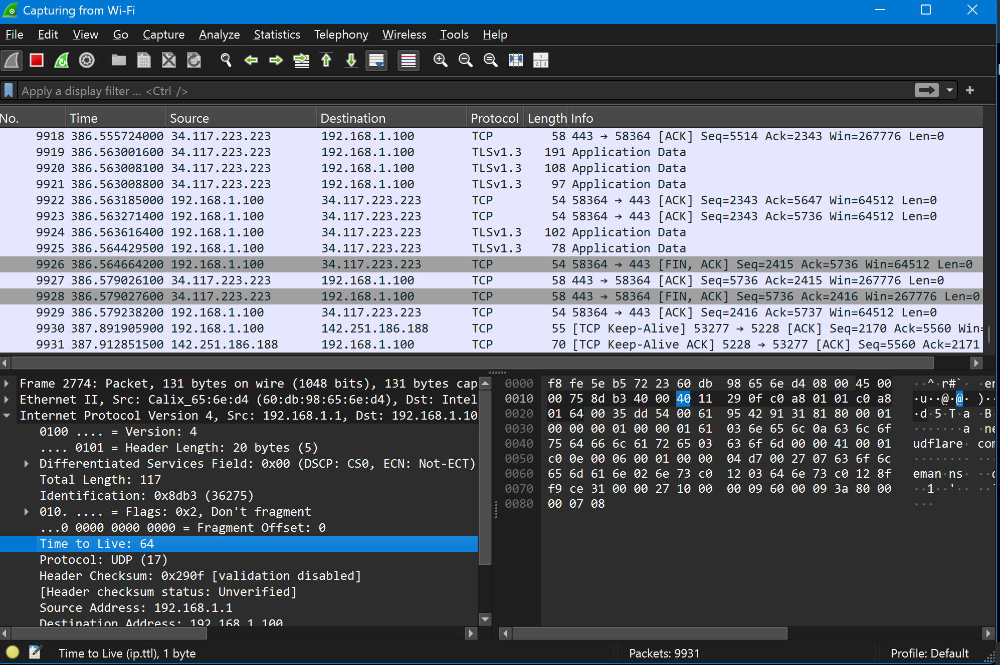

IPv4 TTL acts as a hop limit. Each router that forwards an IPv4 packet decreases the TTL value by one.

If the TTL reaches zero, the packet is discarded.

This prevents packets from circulating indefinitely if a routing loop occurs.

This also reinforced an important Network+ concept:

**IPv4 TTL = hop limit**

---

## DNS Communication Over UDP

I then examined DNS traffic between my computer and the DNS service on my local network.

The DNS response was sent from UDP port 53 to a high-numbered temporary port on my computer.

Port 53 is commonly used for DNS communication.

The high-numbered destination port was an ephemeral port being used by the client for that specific network conversation.

This allowed me to see the relationship between a well-known server port and a temporary client port in real traffic.

---

## DNS A Record Query

I followed a DNS request for:

**a.nel.cloudflare.com**

The query requested an A record.

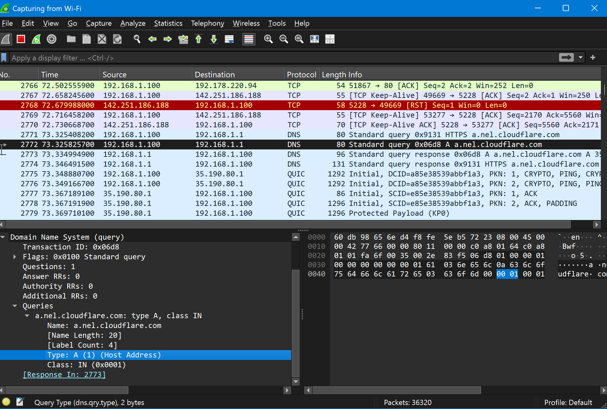

An A record maps a hostname to an IPv4 address.

Instead of simply memorizing what an A record does, I was able to see the DNS request being sent from my computer to the DNS server.

---

## DNS A Record Response

I then followed the matching DNS response.

The DNS server returned the IPv4 address:

**35.190.80.1**

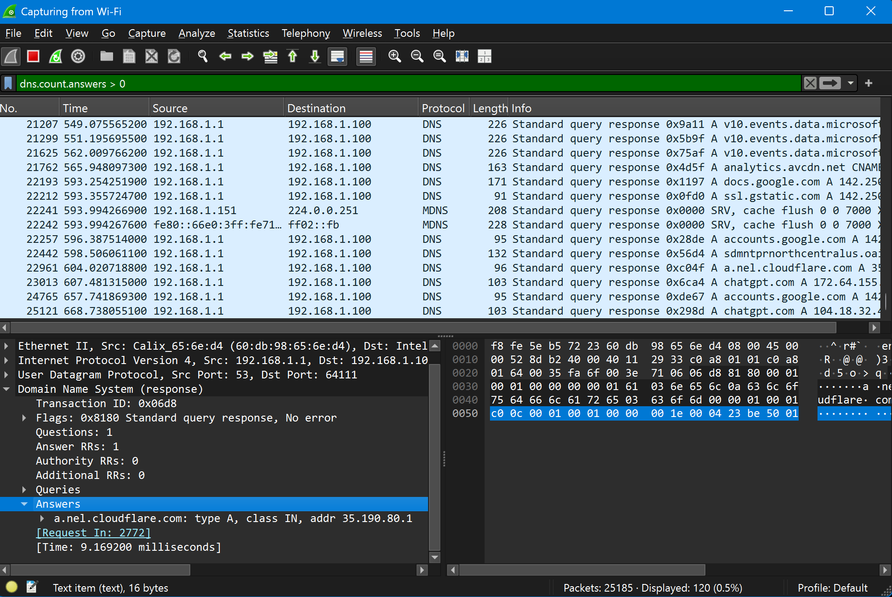

This demonstrated DNS name resolution in real network traffic:

**Hostname → IPv4 Address**

Wireshark also allowed me to match the DNS request with the response that answered it.

---

## DNS Time to Live

Inside the DNS response, I found a DNS TTL value of 30 seconds.

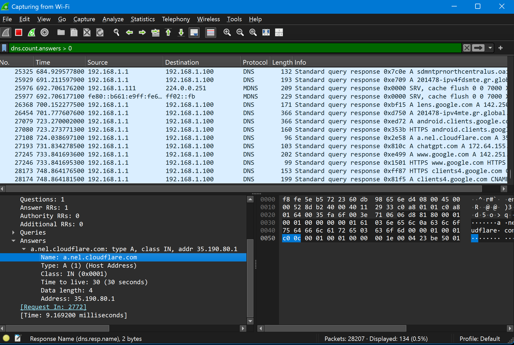

DNS TTL controls how long a DNS record may remain cached before it should be refreshed.

This helped reinforce the difference between two concepts that use the same TTL abbreviation:

**IPv4 TTL = hop limit**

**DNS TTL = cache lifetime**

Although both are called Time to Live, they perform very different functions.

---

## TCP Three-Way Handshake

Next, I isolated a single TCP conversation and followed the process used to establish the connection.

TCP establishes a connection using three steps:

**SYN → SYN-ACK → ACK**

### SYN

The first packet was sent by my computer to request a TCP connection.

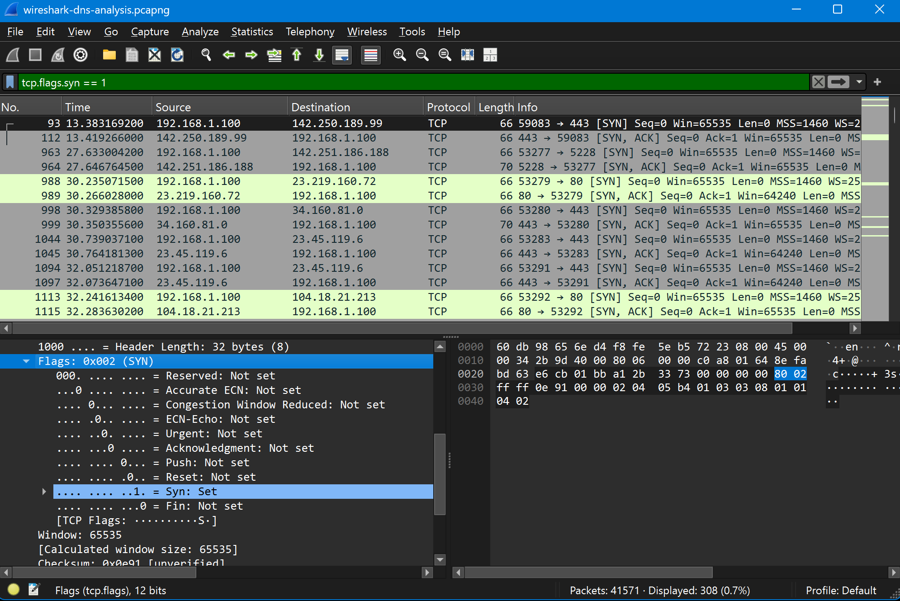

The SYN flag was set while the ACK flag was not set.

This represented the client requesting a new connection.

### SYN-ACK

The remote system responded with both SYN and ACK set.

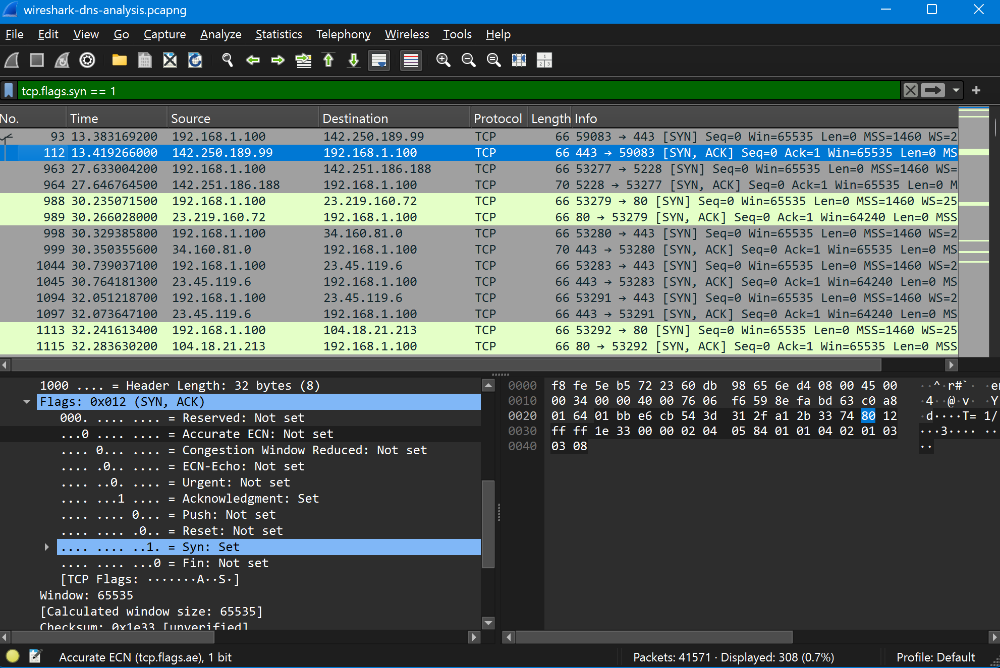

This showed that the server received the request and acknowledged it.

### ACK

My computer then sent the final ACK.

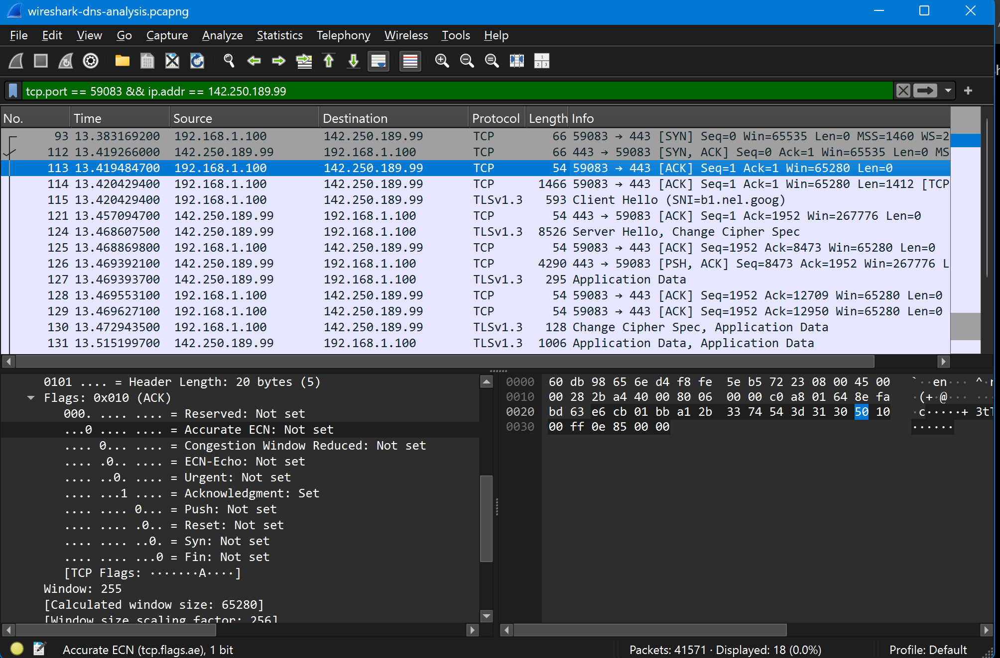

At this point, the TCP connection was established.

Following the packets in Wireshark helped me see the TCP three-way handshake as an actual network conversation instead of only a sequence to memorize.

---

## TLS Client Hello

After the TCP connection was established, the client began negotiating an encrypted TLS session.

Wireshark identified a TLS Client Hello.

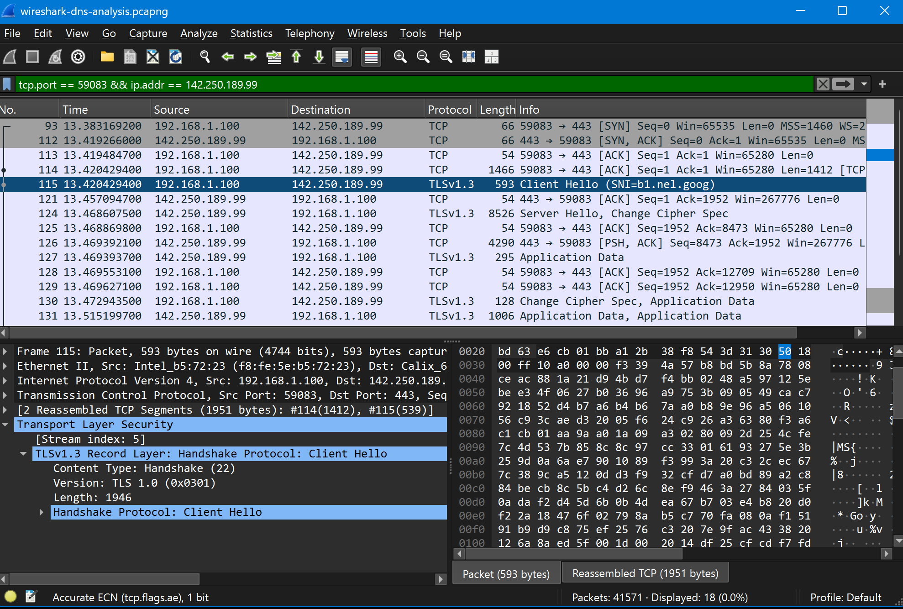

The Client Hello begins the TLS negotiation between the client and server.

---

## TLS Server Hello

The remote server responded with a TLS Server Hello.

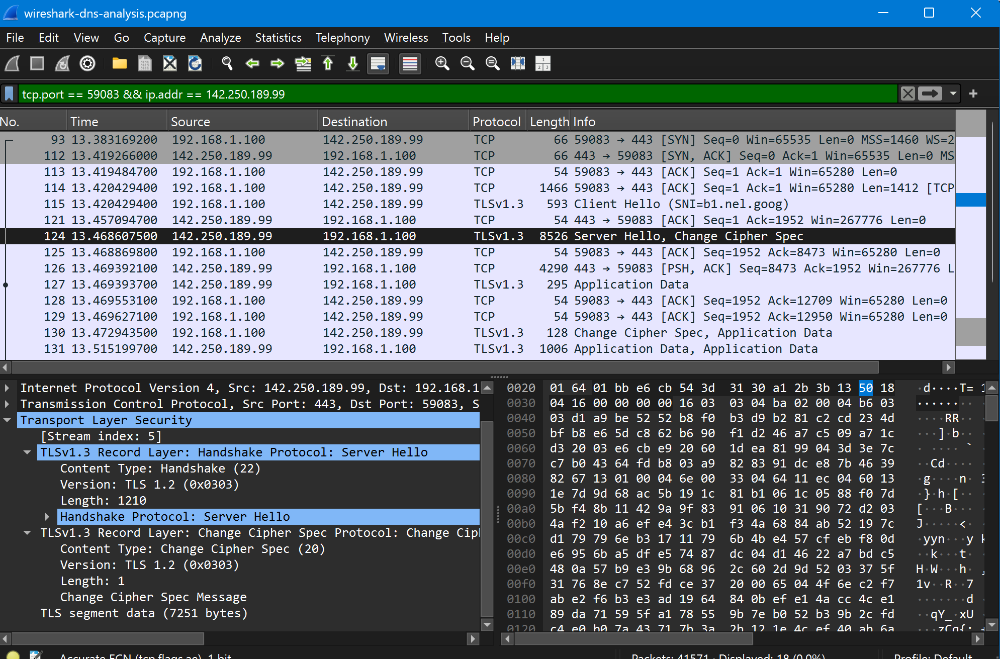

This showed the server participating in the TLS negotiation before encrypted application traffic began.

---

## Encrypted HTTPS Traffic

After the TLS negotiation, Wireshark displayed TLS 1.3 Application Data.

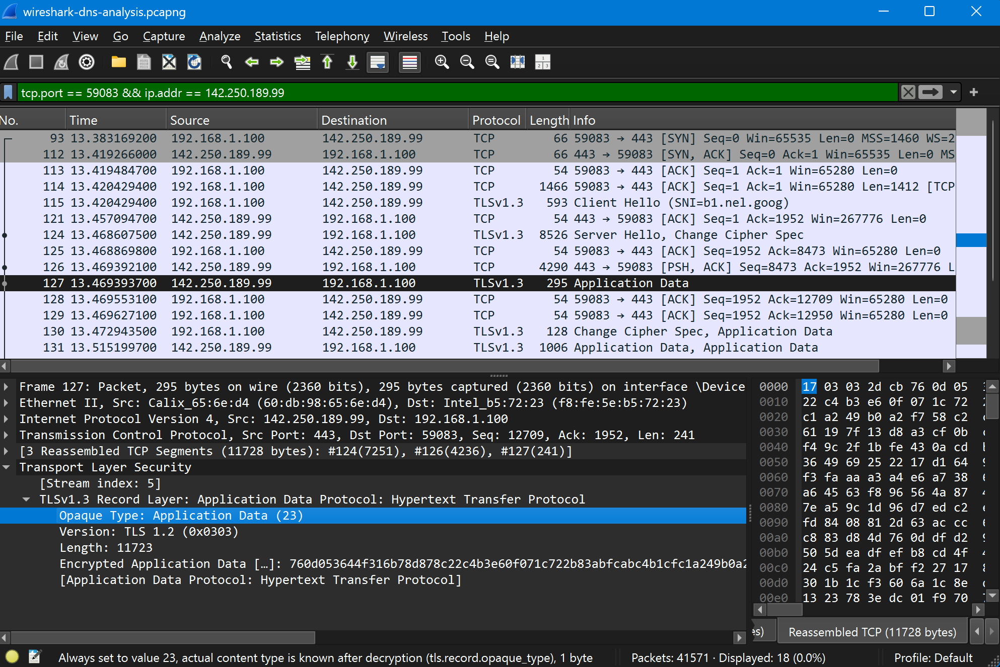

Wireshark identified the application traffic as Hypertext Transfer Protocol, but the actual contents were encrypted.

This demonstrated how HTTPS uses TLS to protect application data while it travels across the network.

The traffic can still be identified and analyzed at the network level even though the protected application contents cannot be read directly.

---

## ARP Address Resolution

I also examined ARP traffic on the local network.

The ARP request asked:

**Who has 192.168.1.100? Tell 192.168.1.1**

The response stated:

**192.168.1.100 is at f8:fe:5e:b5:72:23**

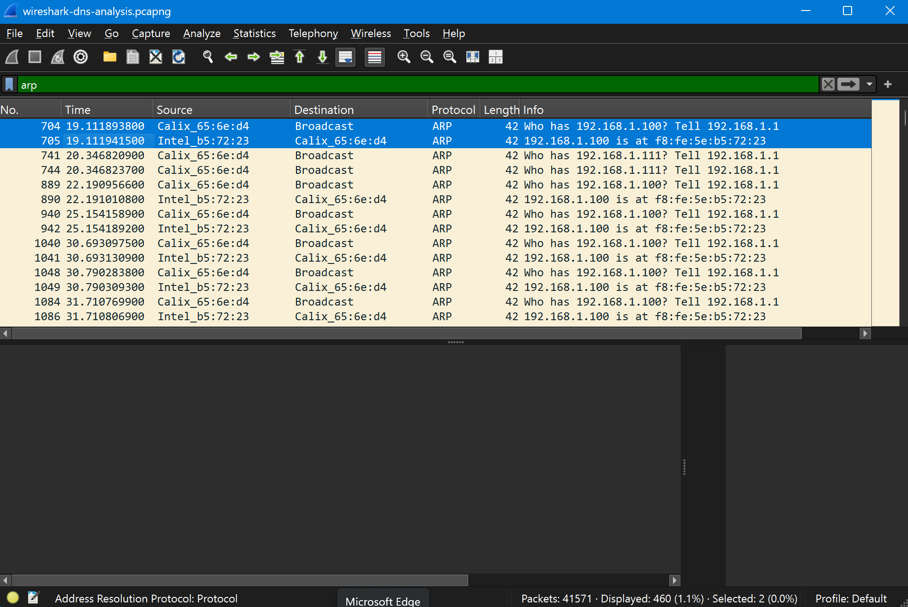

This demonstrated how ARP maps an IPv4 address to a MAC address on a local network.

The request asked which device owned the IP address, and the reply supplied the corresponding MAC address.

---

## Skills Demonstrated

Through this lab, I practiced:

- Wireshark packet capture and analysis
- Network traffic filtering
- IPv4 header inspection
- DNS query and response analysis
- DNS A record identification
- DNS TTL analysis
- TCP and UDP traffic analysis
- TCP three-way handshake analysis
- TCP flag identification
- TLS traffic analysis
- HTTPS encryption concepts
- ARP request and response analysis
- IP-to-MAC address resolution
- Source and destination port identification
- Source and destination IP analysis
- Network troubleshooting concepts

---

## What I Learned

This lab helped connect several CompTIA Network+ concepts to real network behavior.

I learned how to follow a network conversation instead of looking at packets as unrelated lines of data.

I was able to see DNS resolve a hostname into an IPv4 address, identify DNS communication using UDP port 53, and inspect the TTL assigned to a DNS record.

I also observed the TCP three-way handshake from beginning to end by identifying the SYN, SYN-ACK, and ACK packets.

After the TCP connection was established, I followed the beginning of the TLS negotiation and observed encrypted HTTPS application traffic.

The ARP portion of the lab showed how devices on a local network determine which MAC address belongs to a specific IPv4 address.

One of the most useful lessons was seeing the difference between IPv4 TTL and DNS TTL directly in Wireshark.

**IPv4 TTL limits packet hops.**

**DNS TTL controls cache lifetime.**

Most importantly, I gained experience using Wireshark to investigate what is actually happening on a network rather than relying only on theory.

---

## Troubleshooting Relevance

The techniques used in this lab can also be applied to real-world network troubleshooting.

Wireshark can help determine whether:

- DNS requests are being sent
- DNS responses are returning
- A hostname is resolving correctly
- A TCP connection is successfully establishing
- Expected ports are being used
- ARP resolution is occurring
- Traffic is reaching the expected source and destination
- TLS encryption is being used
- Packets are flowing in the expected direction

Packet analysis provides visibility into the actual traffic moving across a network and can help isolate connectivity, DNS, protocol, and application communication problems.

---

## Security Note

I did not upload the original packet capture file to this repository.

Packet capture files may contain private network information, IP addresses, MAC addresses, hostnames, browsing activity, and other sensitive traffic.

Only selected screenshots relevant to the lab are included.

---

## Conclusion

This lab gave me hands-on experience using Wireshark to capture, inspect, filter, and interpret real network traffic.

I analyzed IPv4 TTL, DNS resolution, UDP communication, the TCP three-way handshake, TLS negotiation, encrypted HTTPS traffic, and ARP address resolution.

The project strengthened my CompTIA Network+ knowledge while also giving me practical experience with a tool commonly used for network analysis and troubleshooting.

Instead of only learning what these protocols do, I was able to observe them operating on a live network.
